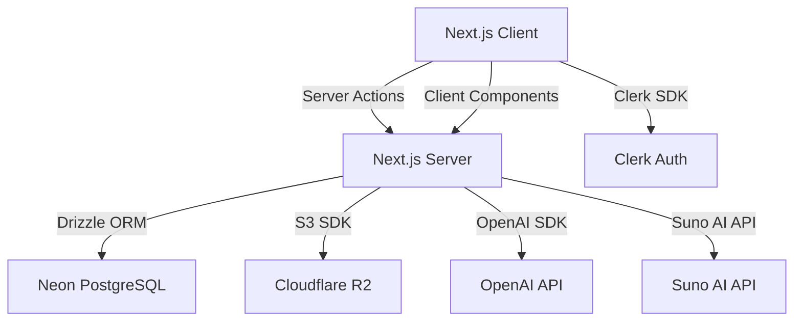
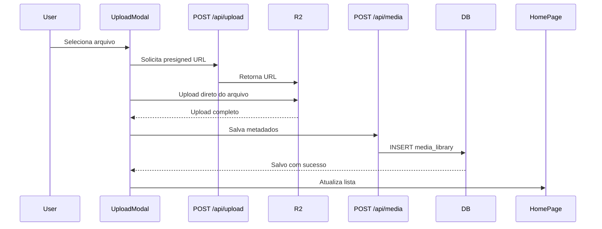
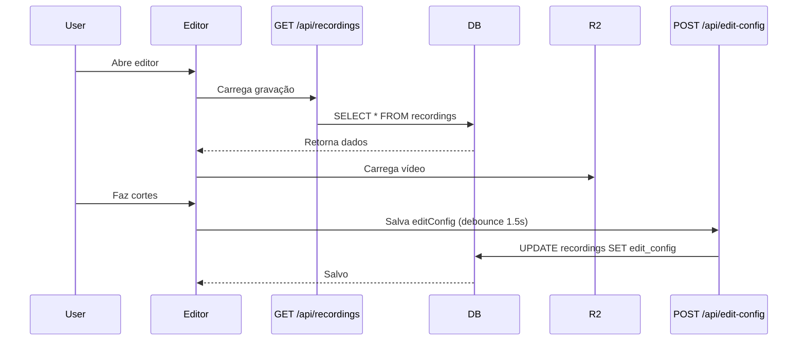
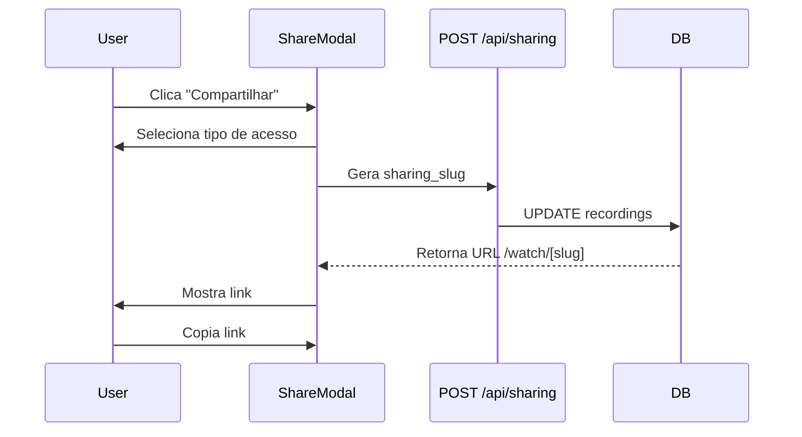

# 🔧 SPECS.md - Especificações Técnicas

*Baseado em PLANEJAMENTO.md v1.0 - 30/01/2026*

## 📋 Índice

1. [Arquitetura Geral](#arquitetura-geral)
2. [Estrutura do Banco de Dados](#estrutura-do-banco-de-dados)
3. [API Endpoints](#api-endpoints)
4. [Especificações por Feature](#especificações-por-feature)
5. [Componentes React](#componentes-react)
6. [Fluxos de Dados](#fluxos-de-dados)
7. [Validações e Edge Cases](#validações-e-edge-cases)
8. [Test Cases](#test-cases)

**Prioridade de Implementação:**
🔴 **CRÍTICA (Fase 0-1):** Landing Page → Stripe → Upload → Sidebar Clerk → Editar Título → Playlists
🟡 **ALTA (Fase 2-3):** Filtros → Lixeira → Gerenciamento Assinatura → Upload Mídia → Lower Thirds
🟢 **MÉDIA/BAIXA (Fase 4-5):** YouTube Elements → Músicas → Legendas → IA Features → Compartilhamento

---

## 🏗️ Arquitetura Geral

### Stack Tecnológica



### Diretórios de Código

```
app/
├── actions/
│   ├── recordings.ts       (Server Actions para vídeos)
│   ├── playlists.ts        (Server Actions para playlists)
│   ├── media.ts            (Server Actions para uploads)
│   ├── sharing.ts          (Server Actions para compartilhamento)
│   └── ai.ts               (Server Actions para IA features)
├── api/
│   ├── upload/route.ts     (Upload presigned URLs)
│   ├── sharing/route.ts   (Página pública)
│   └── cron/
│       └── cleanup-trash   (Lixeira automation)
├── components/
│   ├── home/
│   │   ├── HomePage.tsx    (Dashboard principal)
│   │   ├── VideoCard.tsx   (Card de vídeo)
│   │   ├── UploadModal.tsx (Modal de upload)
│   │   ├── PlaylistModal.tsx (Modal de playlist)
│   │   └── ShareModal.tsx  (Modal de compartilhamento)
│   ├── editor/
│   │   ├── Editor.tsx      (Editor principal)
│   │   ├── Timeline.tsx    (Timeline)
│   │   ├── ElementsPanel.tsx (Aba de Elements)
│   │   ├── LowerThirds.tsx (Editor de lower thirds)
│   │   ├── YouTubeElements.tsx (Editor de YouTube CTA)
│   │   ├── Subtitles.tsx   (Editor de legendas)
│   │   └── AIPanel.tsx     (Painel de IA)
│   ├── shared/
│   │   ├── UserButton.tsx  (Clerk integration)
│   │   ├── FilterBar.tsx   (Barra de filtros)
│   │   └── SearchInput.tsx (Busca)
│   └── ui/                 (Shadcn/ui components)
lib/
├── db.ts                   (Conexão Drizzle)
├── r2.ts                   (Cliente S3 R2)
├── ai/
│   ├── whisper.ts          (Transcrição)
│   ├── gpt.ts              (Resumos)
│   └── suno.ts             (Geração de música)
└── utils.ts                (Utilitários)
hooks/
├── useRecordings.ts        (Hook para vídeos)
├── usePlaylists.ts         (Hook para playlists)
└── useMediaLibrary.ts      (Hook para mídia)
```

---

## 💾 Estrutura do Banco de Dados

### Schema SQL Completo

```sql
-- ========================================
-- TABELAS EXISTENTES (Já implementadas)
-- ========================================

CREATE TABLE users (
  id UUID PRIMARY KEY DEFAULT uuid_generate_v4(),
  email TEXT NOT NULL UNIQUE,
  name TEXT,
  plan_type TEXT NOT NULL DEFAULT 'free', -- free, pro, enterprise
  retention_days INTEGER DEFAULT 7,
  stripe_customer_id TEXT UNIQUE, -- NOVO
  created_at TIMESTAMP DEFAULT NOW()
);

CREATE TABLE recordings (
  id UUID PRIMARY KEY DEFAULT uuid_generate_v4(),
  user_id UUID NOT NULL REFERENCES users(id) ON DELETE CASCADE,
  title TEXT NOT NULL,
  video_key TEXT NOT NULL,
  camera_key TEXT,
  screen_key TEXT,
  thumbnail_key TEXT,
  thumbnail_url TEXT,
  duration INTEGER NOT NULL, -- segundos
  size BIGINT NOT NULL,
  edit_config TEXT DEFAULT '{"cuts":[]}',
  sharing_enabled BOOLEAN DEFAULT false,
  sharing_access TEXT DEFAULT 'public', -- public, password, embed
  sharing_password TEXT, -- bcrypt hash
  allow_download BOOLEAN DEFAULT true,
  sharing_slug TEXT UNIQUE,
  deleted_at TIMESTAMP,
  updated_at TIMESTAMP DEFAULT NOW(),
  created_at TIMESTAMP DEFAULT NOW()
);

-- ========================================
-- NOVAS TABELAS (A implementar)
-- ========================================

-- Subscriptions (Stripe) - NOVO
CREATE TABLE subscriptions (
  id UUID PRIMARY KEY DEFAULT uuid_generate_v4(),
  user_id UUID NOT NULL UNIQUE REFERENCES users(id) ON DELETE CASCADE,
  stripe_customer_id TEXT UNIQUE,
  stripe_subscription_id TEXT UNIQUE,
  stripe_price_id TEXT,
  status TEXT NOT NULL, -- 'active', 'past_due', 'canceled', 'incomplete', 'incomplete_expired'
  current_period_start TIMESTAMP,
  current_period_end TIMESTAMP,
  cancel_at_period_end BOOLEAN DEFAULT false,
  created_at TIMESTAMP DEFAULT NOW(),
  updated_at TIMESTAMP DEFAULT NOW()
);

CREATE INDEX idx_subscriptions_user ON subscriptions(user_id);
CREATE INDEX idx_subscriptions_stripe_customer ON subscriptions(stripe_customer_id);

-- Invoices (Stripe) - NOVO
CREATE TABLE invoices (
  id UUID PRIMARY KEY DEFAULT uuid_generate_v4(),
  user_id UUID NOT NULL REFERENCES users(id) ON DELETE CASCADE,
  stripe_invoice_id TEXT UNIQUE,
  amount INTEGER NOT NULL, -- in cents
  currency TEXT DEFAULT 'BRL',
  status TEXT NOT NULL, -- 'draft', 'open', 'paid', 'void', 'uncollectible'
  invoice_url TEXT,
  created_at TIMESTAMP DEFAULT NOW()
);

CREATE INDEX idx_invoices_user ON invoices(user_id);

-- Playlists
CREATE TABLE playlists (
  id UUID PRIMARY KEY DEFAULT uuid_generate_v4(),
  user_id UUID NOT NULL REFERENCES users(id) ON DELETE CASCADE,
  name TEXT NOT NULL,
  description TEXT,
  color TEXT DEFAULT '#6366f1',
  created_at TIMESTAMP DEFAULT NOW(),
  updated_at TIMESTAMP DEFAULT NOW()
);

CREATE INDEX idx_playlists_user ON playlists(user_id);

-- Playlist Videos (Relacionamento many-to-many)
CREATE TABLE playlist_videos (
  playlist_id UUID NOT NULL REFERENCES playlists(id) ON DELETE CASCADE,
  recording_id UUID NOT NULL REFERENCES recordings(id) ON DELETE CASCADE,
  position INTEGER NOT NULL,
  added_at TIMESTAMP DEFAULT NOW(),
  PRIMARY KEY (playlist_id, recording_id)
);

CREATE INDEX idx_playlist_videos_recording ON playlist_videos(recording_id);

-- Media Library
CREATE TABLE media_library (
  id UUID PRIMARY KEY DEFAULT uuid_generate_v4(),
  user_id UUID NOT NULL REFERENCES users(id) ON DELETE CASCADE,
  type TEXT NOT NULL CHECK (type IN ('video', 'image', 'audio', 'lower_third', 'youtube_element')),
  filename TEXT NOT NULL,
  r2_key TEXT NOT NULL,
  duration INTEGER, -- para vídeos/áudio em segundos
  size INTEGER NOT NULL, -- bytes
  width INTEGER, -- para imagens/vídeos
  height INTEGER, -- para imagens/vídeos
  config JSONB DEFAULT '{}', -- config custom para lower_thirds, youtube_elements
  created_at TIMESTAMP DEFAULT NOW()
);

CREATE INDEX idx_media_library_user ON media_library(user_id);
CREATE INDEX idx_media_library_type ON media_library(type);

-- Video Views (Analytics)
CREATE TABLE video_views (
  id UUID PRIMARY KEY DEFAULT uuid_generate_v4(),
  recording_id UUID NOT NULL REFERENCES recordings(id) ON DELETE CASCADE,
  viewer_ip TEXT,
  user_agent TEXT,
  viewed_at TIMESTAMP DEFAULT NOW()
);

CREATE INDEX idx_video_views_recording ON video_views(recording_id);
CREATE INDEX idx_video_views_date ON video_views(viewed_at);

-- Subtitles
CREATE TABLE subtitles (
  id UUID PRIMARY KEY DEFAULT uuid_generate_v4(),
  recording_id UUID NOT NULL REFERENCES recordings(id) ON DELETE CASCADE,
  language TEXT DEFAULT 'pt-BR',
  content JSONB NOT NULL, -- array de {start, end, text}
  style JSONB DEFAULT '{}', -- {font, size, color, position, backgroundColor, etc}
  created_at TIMESTAMP DEFAULT NOW(),
  updated_at TIMESTAMP DEFAULT NOW()
);

CREATE INDEX idx_subtitles_recording ON subtitles(recording_id);

-- Cron Jobs (Schedule tracking)
CREATE TABLE cron_jobs (
  id UUID PRIMARY KEY DEFAULT uuid_generate_v4(),
  name TEXT NOT NULL UNIQUE,
  last_run TIMESTAMP,
  status TEXT DEFAULT 'idle', -- idle, running, success, failed
  error_message TEXT,
  created_at TIMESTAMP DEFAULT NOW()
);
```

---

## 🌐 API Endpoints

### Server Actions (Next.js 15)

#### `app/actions/recordings.ts`

```typescript
// Upload de vídeo externo
export async function uploadVideoAction({
  file: File;
  title: string;
}): Promise<{ success: boolean; recording?: Recording; error?: string }>

// Atualizar título
export async function updateTitleAction({
  recordingId: string;
  title: string;
}): Promise<{ success: boolean; error?: string }>

// Soft delete
export async function softDeleteAction({
  recordingId: string;
}): Promise<{ success: boolean; error?: string }>

// Restore from trash
export async function restoreAction({
  recordingId: string;
}): Promise<{ success: boolean; error?: string }>

// Permanent delete
export async function permanentDeleteAction({
  recordingId: string;
}): Promise<{ success: boolean; error?: string }>

// Toggle sharing
export async function toggleSharingAction({
  recordingId: string;
  enabled: boolean;
  accessType: 'public' | 'password' | 'embed';
  password?: string;
  allowDownload: boolean;
}): Promise<{ success: boolean; sharingSlug?: string; error?: string }>

// Get sharing URL
export async function getSharingUrlAction({
  recordingId: string;
}): Promise<{ success: boolean; url?: string; error?: string }>
```

#### `app/actions/playlists.ts`

```typescript
// Create playlist
export async function createPlaylistAction({
  name: string;
  description?: string;
  color?: string;
}): Promise<{ success: boolean; playlist?: Playlist; error?: string }>

// Update playlist
export async function updatePlaylistAction({
  playlistId: string;
  name?: string;
  description?: string;
  color?: string;
}): Promise<{ success: boolean; error?: string }>

// Delete playlist
export async function deletePlaylistAction({
  playlistId: string;
}): Promise<{ success: boolean; error?: string }>

// Add video to playlist
export async function addToPlaylistAction({
  playlistId: string;
  recordingId: string;
}): Promise<{ success: boolean; error?: string }>

// Remove from playlist
export async function removeFromPlaylistAction({
  playlistId: string;
  recordingId: string;
}): Promise<{ success: boolean; error?: string }>

// Reorder videos in playlist
export async function reorderPlaylistVideosAction({
  playlistId: string;
  recordingIds: string[];
}): Promise<{ success: boolean; error?: string }>

// Get all playlists with videos
export async function getPlaylistsAction(): Promise<{
  success: boolean;
  playlists?: Playlist[];
  error?: string;
}>
```

#### `app/actions/media.ts`

```typescript
// Upload media to library
export async function uploadMediaAction({
  file: File;
  type: 'video' | 'image' | 'audio';
}): Promise<{ success: boolean; media?: MediaItem; error?: string }>

// Create custom lower third
export async function createLowerThirdAction({
  config: LowerThirdConfig;
}): Promise<{ success: boolean; media?: MediaItem; error?: string }>

// Create youtube element
export async function createYouTubeElementAction({
  config: YouTubeElementConfig;
}): Promise<{ success: boolean; media?: MediaItem; error?: string }>

// Delete media
export async function deleteMediaAction({
  mediaId: string;
}): Promise<{ success: boolean; error?: string }>

// Get media library
export async function getMediaLibraryAction({
  type?: 'video' | 'image' | 'audio' | 'lower_third' | 'youtube_element';
}): Promise<{ success: boolean; media?: MediaItem[]; error?: string }>
```

#### `app/actions/sharing.ts`

```typescript
// Verify sharing password
export async function verifySharingPasswordAction({
  slug: string;
  password: string;
}): Promise<{ success: boolean; token?: string; error?: string }>

// Log video view
export async function logVideoViewAction({
  slug: string;
}): Promise<{ success: boolean; error?: string }>

// Get sharing metadata
export async function getSharingMetadataAction({
  slug: string;
}): Promise<{ success: boolean; metadata?: SharingMetadata; error?: string }>
```

#### `app/actions/ai.ts`

```typescript
// Transcribe video (Whisper)
export async function transcribeVideoAction({
  recordingId: string;
  language?: string;
}): Promise<{ success: boolean; subtitles?: SubtitleContent; error?: string }>

// Generate summary (GPT-4)
export async function generateSummaryAction({
  transcript: string;
  videoTitle: string;
}): Promise<{ success: boolean; summary?: VideoSummary; error?: string }>

// Detect silences (AI)
export async function detectSilencesAction({
  recordingId: string;
  threshold: number; // dB
  minDuration: number; // seconds
}): Promise<{ success: boolean; silences?: SilenceMarker[]; error?: string }>

// Generate music (Suno AI)
export async function generateMusicAction({
  prompt: string;
  duration: number;
  mood: string;
  style: string;
}): Promise<{ success: boolean; musicUrl?: string; error?: string }>

// Apply auto-cuts
export async function applyAutoCutsAction({
  recordingId: string;
  cuts: TimelineAction[];
}): Promise<{ success: boolean; error?: string }>
```

#### `app/actions/subscriptions.ts`

```typescript
// Create Stripe checkout session
export async function createCheckoutAction({
  priceId,
  userId,
}: {
  priceId: string;
  userId: string;
}): Promise<{ success: boolean; url?: string; error?: string }>

// Get subscription status
export async function getSubscriptionAction({
  userId,
}: {
  userId: string;
}): Promise<{ success: boolean; subscription?: Subscription; error?: string }>

// Cancel subscription
export async function cancelSubscriptionAction({
  userId,
}: {
  userId: string;
}): Promise<{ success: boolean; error?: string }>

// Get invoices
export async function getInvoicesAction({
  userId,
}: {
  userId: string;
}): Promise<{ success: boolean; invoices?: Invoice[]; error?: string }>
```

### API Routes

#### `app/api/stripe/webhook/route.ts`

```typescript
// POST /api/stripe/webhook
// Purpose: Handle Stripe webhook events
// Events:
//   - checkout.session.completed (new subscription)
//   - customer.subscription.updated (upgrade/downgrade)
//   - customer.subscription.deleted (cancel)
```

#### `app/api/stripe/create-checkout/route.ts`

```typescript
// POST /api/stripe/create-checkout
// Request body: { priceId: string }
// Response: { url: string } (Stripe Checkout URL)
```

#### `app/api/upload/route.ts`

```typescript
// POST /api/upload
// Request body: { fileName: string; contentType: string }
// Response: { uploadUrl: string; key: string; }
// Purpose: Generate presigned URL for direct upload to R2
```

#### `app/api/sharing/[slug]/route.ts`

```typescript
// GET /api/sharing/[slug]
// Purpose: Serve public video page
// Headers: Cookie with auth token (if password protected)
```

#### `app/api/cron/cleanup-trash/route.ts`

```typescript
// POST /api/cron/cleanup-trash
// Purpose: Delete videos in trash after retention period
// Auth: Internal cron job token
```

---

## 📦 Especificações por Feature

---

## 0. LANDING PAGE (Feature 0.1)

### Requisitos Funcionais

#### 0.1.1 Hero Section

**Componentes:**
```typescript
// app/(landing)/page.tsx
'use client';

import { Button } from '@/components/ui/button';
import { ArrowRight, Play } from 'lucide-react';

export default function LandingPage() {
  return (
    <div className="min-h-screen">
      {/* Hero Section */}
      <section className="py-20 px-4 text-center">
        <Badge variant="secondary" className="mb-4">
          🚀 Novo: Legendas automáticas com IA
        </Badge>

        <h1 className="text-5xl md:text-7xl font-bold mb-6">
          Grave. Edite.
          <br />
          <span className="text-indigo-600">Publique.</span>
        </h1>

        <p className="text-xl text-slate-600 max-w-2xl mx-auto mb-8">
          Gravação de tela com câmera, editor rápido, lower thirds
          personalizados e tudo o que você precisa para crescer no YouTube.
        </p>

        <div className="flex gap-4 justify-center">
          <Button size="lg" asChild>
            <Link href="/signup">
              Começar Grátis <ArrowRight className="ml-2 w-4 h-4" />
            </Link>
          </Button>
          <Button size="lg" variant="outline" asChild>
            <Link href="/demo">
              <Play className="mr-2 w-4 h-4" /> Ver Demo
            </Link>
          </Button>
        </div>

        {/* Video Preview */}
        <div className="mt-12 max-w-4xl mx-auto rounded-2xl overflow-hidden shadow-2xl">
          <video
            src="/demo-video.mp4"
            autoPlay
            muted
            loop
            playsInline
            className="w-full"
          />
        </div>
      </section>

      {/* Features Grid */}
      <FeaturesGrid />
      {/* Pricing */}
      <PricingSection />
      {/* Social Proof */}
      <SocialProof />
      {/* FAQ */}
      <FAQ />
      {/* Footer */}
      <Footer />
    </div>
  );
}
```

#### 0.1.2 Pricing Section

**Preços:**
```typescript
const PLANS = [
  {
    name: 'Free',
    price: 0,
    period: 'mês',
    features: [
      '500MB de armazenamento',
      '7 dias na lixeira',
      'Gravação de tela + câmera',
      'Editor básico',
    ],
    cta: 'Começar Grátis',
    priceId: 'price_free',
  },
  {
    name: 'Pro',
    price: 19,
    period: 'mês',
    yearlyPrice: 15, // 20% off
    badge: 'Mais Popular',
    features: [
      '2GB de armazenamento',
      '30 dias na lixeira',
      'Tudo do Free +',
      'Lower thirds customizáveis',
      'YouTube elements',
      'IA para legendas',
      'IA para resumos',
      'IA para cortes automáticos',
      'Compartilhamento público',
    ],
    cta: 'Assinar Pro',
    priceId: 'price_pro_monthly',
    yearlyPriceId: 'price_pro_yearly',
  },
  {
    name: 'Enterprise',
    price: 49,
    period: 'mês',
    yearlyPrice: 39,
    features: [
      '10GB de armazenamento',
      '90 dias na lixeira',
      'Tudo do Pro +',
      'Suporte prioritário',
      'API access',
      'Team collaboration',
      'Custom branding',
    ],
    cta: 'Falar com Vendas',
    priceId: 'price_ent_monthly',
    yearlyPriceId: 'price_ent_yearly',
  },
];
```

**Componente de Pricing:**
```typescript
function PricingSection() {
  const [yearly, setYearly] = useState(false);

  return (
    <section className="py-20 bg-slate-50">
      <div className="container mx-auto px-4">
        <div className="text-center mb-12">
          <h2 className="text-4xl font-bold mb-4">Escolha seu plano</h2>
          <p className="text-slate-600">
            Comece grátis, upgrade quando precisar
          </p>

          {/* Toggle Mensal/Anual */}
          <div className="mt-6 inline-flex items-center gap-2">
            <span className={!yearly ? 'font-medium' : 'text-slate-500'}>
              Mensal
            </span>
            <Switch checked={yearly} onCheckedChange={setYearly} />
            <span className={yearly ? 'font-medium' : 'text-slate-500'}>
              Anual
            </span>
            <Badge variant="secondary">20% OFF</Badge>
          </div>
        </div>

        <div className="grid md:grid-cols-3 gap-8">
          {PLANS.map((plan) => (
            <PricingCard key={plan.name} plan={plan} yearly={yearly} />
          ))}
        </div>
      </div>
    </section>
  );
}
```

---

## 💳 SISTEMA DE PAGAMENTOS (Feature 1.10)

### Requisitos Funcionais

#### 1.10.1 Checkout Flow

**Fluxo:**
1. Usuário clica em "Assinar Pro" → chama `createCheckoutAction`
2. Backend cria Stripe Checkout Session:
   - Passa `priceId` (ex: `price_pro_monthly`)
   - Passa `userId` como metadata
   - Passa `cancelUrl` → volta para pricing
   - Passa `successUrl` → `/settings/subscription?success=true`
3. Redireciona para Stripe Checkout
4. Usuário paga → Stripe envia webhook
5. Webhook atualiza `plan_type` no banco
6. Usuário é redirecionado para página de sucesso

**Server Action:**
```typescript
// app/actions/subscriptions.ts
import Stripe from 'stripe';

const stripe = new Stripe(process.env.STRIPE_SECRET_KEY!, {
  apiVersion: '2024-11-20.acacia',
});

export async function createCheckoutAction({
  priceId,
  userId,
}: {
  priceId: string;
  userId: string;
}): Promise<{ success: boolean; url?: string; error?: string }> {
  try {
    const user = await getUserById(userId);
    if (!user) {
      return { success: false, error: 'User not found' };
    }

    // Create or get Stripe customer
    let customerId = user.stripeCustomerId;

    if (!customerId) {
      const customer = await stripe.customers.create({
        email: user.email,
        metadata: { userId },
      });
      customerId = customer.id;

      // Update user with stripe_customer_id
      await updateUserStripeCustomerId(userId, customerId);
    }

    // Create checkout session
    const session = await stripe.checkout.sessions.create({
      customer: customerId,
      mode: 'subscription',
      payment_method_types: ['card'],
      line_items: [
        {
          price: priceId,
          quantity: 1,
        },
      ],
      success_url: `${process.env.NEXT_PUBLIC_APP_URL}/settings/subscription?success=true`,
      cancel_url: `${process.env.NEXT_PUBLIC_APP_URL}/pricing`,
      metadata: { userId },
      allow_promotion_codes: true,
      billing_address_collection: 'auto',
    });

    return { success: true, url: session.url };
  } catch (error) {
    console.error('Stripe checkout error:', error);
    return { success: false, error: 'Failed to create checkout' };
  }
}
```

#### 1.10.2 Stripe Webhook

**API Route:**
```typescript
// app/api/stripe/webhook/route.ts
import Stripe from 'stripe';
import { NextRequest, NextResponse } from 'next/server';
import { neon } from '@neondatabase/serverless';

const stripe = new Stripe(process.env.STRIPE_WEBHOOK_SECRET!, {
  apiVersion: '2024-11-20.acacia',
});

const webhookSecret = process.env.STRIPE_WEBHOOK_SECRET!;

export async function POST(request: NextRequest) {
  try {
    const body = await request.text();
    const sig = request.headers.get('stripe-signature')!;

    // Verify webhook signature
    const event = stripe.webhooks.constructEvent(body, sig, webhookSecret);

    const dbUrl = process.env.DATABASE_URL;
    const sql = neon(dbUrl);

    switch (event.type) {
      case 'checkout.session.completed': {
        const session = event.data.object as Stripe.Checkout.Session;
        const userId = session.metadata?.userId;

        if (userId) {
          // Get subscription details
          const subscriptionId = session.subscription as string;
          const subscription = await stripe.subscriptions.retrieve(subscriptionId);
          const priceId = subscription.items.data[0].price.id;

          // Determine plan type
          const planType = getPlanTypeFromPriceId(priceId);

          // Update user plan
          await sql`
            UPDATE users
            SET plan_type = ${planType}
            WHERE id = ${userId}
          `;

          // Create subscription record
          await sql`
            INSERT INTO subscriptions (
              user_id,
              stripe_customer_id,
              stripe_subscription_id,
              stripe_price_id,
              status,
              current_period_start,
              current_period_end
            )
            VALUES (
              ${userId},
              ${session.customer as string},
              ${subscriptionId},
              ${priceId},
              ${subscription.status},
              ${new Date(subscription.current_period_start * 1000)},
              ${new Date(subscription.current_period_end * 1000)}
            )
            ON CONFLICT (user_id) DO UPDATE SET
              stripe_subscription_id = ${subscriptionId},
              stripe_price_id = ${priceId},
              status = ${subscription.status},
              current_period_start = ${new Date(subscription.current_period_start * 1000)},
              current_period_end = ${new Date(subscription.current_period_end * 1000)},
              updated_at = NOW()
          `;
        }
        break;
      }

      case 'customer.subscription.updated': {
        const subscription = event.data.object as Stripe.Subscription;
        const userId = await getUserIdFromCustomerId(subscription.customer as string);

        if (userId) {
          const priceId = subscription.items.data[0].price.id;
          const planType = getPlanTypeFromPriceId(priceId);

          await sql`
            UPDATE users
            SET plan_type = ${planType}
            WHERE id = ${userId}
          `;

          await sql`
            UPDATE subscriptions
            SET
              stripe_price_id = ${priceId},
              status = ${subscription.status},
              current_period_start = ${new Date(subscription.current_period_start * 1000)},
              current_period_end = ${new Date(subscription.current_period_end * 1000)},
              cancel_at_period_end = ${subscription.cancel_at_period_end},
              updated_at = NOW()
            WHERE user_id = ${userId}
          `;
        }
        break;
      }

      case 'customer.subscription.deleted': {
        const subscription = event.data.object as Stripe.Subscription;
        const userId = await getUserIdFromCustomerId(subscription.customer as string);

        if (userId) {
          // Revert to free plan
          await sql`
            UPDATE users
            SET plan_type = 'free'
            WHERE id = ${userId}
          `;

          await sql`
            UPDATE subscriptions
            SET
              status = 'canceled',
              updated_at = NOW()
            WHERE user_id = ${userId}
          `;
        }
        break;
      }

      case 'invoice.paid': {
        const invoice = event.data.object as Stripe.Invoice;
        const subscriptionId = invoice.subscription as string;

        // Get user from subscription
        const subscriptions = await sql`
          SELECT user_id FROM subscriptions
          WHERE stripe_subscription_id = ${subscriptionId}
        `;

        if (subscriptions.length > 0) {
          const userId = subscriptions[0].user_id;

          // Create invoice record
          await sql`
            INSERT INTO invoices (
              user_id,
              stripe_invoice_id,
              amount,
              currency,
              status,
              invoice_url
            )
            VALUES (
              ${userId},
              ${invoice.id},
              ${invoice.amount_paid},
              ${invoice.currency},
              ${invoice.status},
              ${invoice.hosted_invoice_url}
            )
          `;
        }
        break;
      }
    }

    return NextResponse.json({ received: true });
  } catch (error) {
    console.error('Stripe webhook error:', error);
    return NextResponse.json(
      { error: 'Webhook handler failed' },
      { status: 400 }
    );
  }
}

function getPlanTypeFromPriceId(priceId: string): 'free' | 'pro' | 'enterprise' {
  if (priceId.includes('pro')) return 'pro';
  if (priceId.includes('ent')) return 'enterprise';
  return 'free';
}

async function getUserIdFromCustomerId(customerId: string): Promise<string | null> {
  const dbUrl = process.env.DATABASE_URL;
  const sql = neon(dbUrl);

  const users = await sql`
    SELECT id FROM users
    WHERE stripe_customer_id = ${customerId}
  `;

  return users[0]?.id || null;
}
```

#### 1.10.3 Subscription Management Page

**Componente:**
```typescript
// app/settings/subscription/page.tsx
'use client';

import { useEffect, useState } from 'react';
import { Button } from '@/components/ui/button';
import {
  Card,
  CardContent,
  CardDescription,
  CardHeader,
  CardTitle,
} from '@/components/ui/card';
import { Badge } from '@/components/ui/badge';
import { ExternalLink, Check, X, ArrowRight } from 'lucide-react';

export default function SubscriptionPage() {
  const [subscription, setSubscription] = useState<Subscription | null>(null);
  const [invoices, setInvoices] = useState<Invoice[]>([]);
  const [loading, setLoading] = useState(true);

  useEffect(() => {
    loadSubscription();
  }, []);

  const loadSubscription = async () => {
    const result = await getSubscriptionAction();
    if (result.subscription) {
      setSubscription(result.subscription);
    }

    const invoicesResult = await getInvoicesAction();
    if (result.success) {
      setInvoices(invoicesResult.invoices || []);
    }

    setLoading(false);
  };

  const handleUpgrade = (priceId: string) => {
    // Redirect to checkout
    window.location.href = `/api/stripe/create-checkout?priceId=${priceId}`;
  };

  const handleCancel = async () => {
    const result = await cancelSubscriptionAction();
    if (result.success) {
      // Reload subscription
      await loadSubscription();
    }
  };

  if (loading) {
    return <div className="p-8">Loading...</div>;
  }

  const currentPlan = subscription
    ? PLAN_CONFIGS[subscription.plan_type]
    : PLAN_CONFIGS.free;

  return (
    <div className="max-w-4xl mx-auto p-8">
      <h1 className="text-3xl font-bold mb-8">Assinatura</h1>

      {/* Current Plan */}
      <Card className="mb-8">
        <CardHeader>
          <div className="flex items-center justify-between">
            <div>
              <CardTitle className="flex items-center gap-2">
                Plano Atual: {currentPlan.name}
                <Badge>{currentPlan.price}/mês</Badge>
              </CardTitle>
              <CardDescription>
                {subscription
                  ? `Renova em ${new Date(subscription.currentPeriodEnd).toLocaleDateString('pt-BR')}`
                  : 'Plano gratuito'}
              </CardDescription>
            </div>
            {subscription?.plan_type !== 'free' && (
              <Button variant="outline" onClick={handleCancel}>
                Cancelar Assinatura
              </Button>
            )}
          </div>
        </CardHeader>
        <CardContent>
          <div className="grid md:grid-cols-2 gap-4">
            {currentPlan.features.map((feature) => (
              <div key={feature} className="flex items-center gap-2">
                <Check className="w-5 h-5 text-green-500" />
                <span>{feature}</span>
              </div>
            ))}
          </div>
        </CardContent>
      </Card>

      {/* Upgrade Options */}
      {subscription?.plan_type === 'free' && (
        <Card className="mb-8">
          <CardHeader>
            <CardTitle>Upgrade para desbloquear mais recursos</CardTitle>
          </CardHeader>
          <CardContent>
            <div className="grid md:grid-cols-2 gap-4">
              {Object.values(PLAN_CONFIGS)
                .filter((plan) => plan.name !== 'Free')
                .map((plan) => (
                  <Card key={plan.name}>
                    <CardHeader>
                      <CardTitle>{plan.name}</CardTitle>
                      <CardDescription>{plan.price}/mês</CardDescription>
                    </CardHeader>
                    <CardContent>
                      <ul className="space-y-2 mb-4">
                        {plan.features.slice(0, 3).map((feature) => (
                          <li key={feature} className="flex items-center gap-2">
                            <Check className="w-4 h-4 text-green-500" />
                            <span>{feature}</span>
                          </li>
                        ))}
                      </ul>
                      <Button
                        className="w-full"
                        onClick={() => handleUpgrade(plan.priceId)}
                      >
                        Assinar {plan.name}
                        <ArrowRight className="ml-2 w-4 h-4" />
                      </Button>
                    </CardContent>
                  </Card>
                ))}
            </div>
          </CardContent>
        </Card>
      )}

      {/* Invoices */}
      <Card>
        <CardHeader>
          <CardTitle>Histórico de Faturas</CardTitle>
        </CardHeader>
        <CardContent>
          {invoices.length === 0 ? (
            <p className="text-slate-500">Nenhuma fatura encontrada</p>
          ) : (
            <div className="space-y-2">
              {invoices.map((invoice) => (
                <div
                  key={invoice.id}
                  className="flex items-center justify-between p-3 bg-slate-50 rounded-lg"
                >
                  <div>
                    <div className="font-medium">
                      {new Date(invoice.createdAt).toLocaleDateString('pt-BR')}
                    </div>
                    <div className="text-sm text-slate-500">
                      {invoice.amount / 100} {invoice.currency.toUpperCase()}
                    </div>
                  </div>
                  <div className="flex items-center gap-2">
                    <Badge>{invoice.status}</Badge>
                    {invoice.invoiceUrl && (
                      <Button variant="ghost" size="icon" asChild>
                        <a href={invoice.invoiceUrl} target="_blank">
                          <ExternalLink className="w-4 h-4" />
                        </a>
                      </Button>
                    )}
                  </div>
                </div>
              ))}
            </div>
          )}
        </CardContent>
      </Card>
    </div>
  );
}

const PLAN_CONFIGS = {
  free: {
    name: 'Free',
    price: 0,
    features: [
      '500MB de armazenamento',
      '7 dias na lixeira',
      'Gravação de tela + câmera',
      'Editor básico',
    ],
  },
  pro: {
    name: 'Pro',
    price: 19,
    priceId: 'price_pro_monthly',
    features: [
      '2GB de armazenamento',
      '30 dias na lixeira',
      'Tudo do Free +',
      'Lower thirds customizáveis',
      'YouTube elements',
      'IA para legendas',
      'IA para resumos',
      'IA para cortes automáticos',
      'Compartilhamento público',
    ],
  },
  enterprise: {
    name: 'Enterprise',
    price: 49,
    priceId: 'price_ent_monthly',
    features: [
      '10GB de armazenamento',
      '90 dias na lixeira',
      'Tudo do Pro +',
      'Suporte prioritário',
      'API access',
      'Team collaboration',
      'Custom branding',
    ],
  },
};
```

---

## 1. UPLOAD DE VÍDEO (Feature 1.1)

### Requisitos Funcionais

#### 1.1.1 Upload de Arquivo

**Input:**
- Arquivo de vídeo (mp4, webm, mov, avi)
- Título do vídeo (opcional, default = filename)

**Validações:**
```typescript
const VIDEO_FORMATS = ['mp4', 'webm', 'mov', 'avi'] as const;
const MAX_SIZE = {
  free: 500 * 1024 * 1024,      // 500MB
  pro: 2 * 1024 * 1024 * 1024,   // 2GB
  enterprise: 10 * 1024 * 1024 * 1024 // 10GB
};

type VideoFormat = typeof VIDEO_FORMATS[number];
```

**Validação de formato:**
```typescript
function validateVideoFormat(filename: string): boolean {
  const ext = filename.split('.').pop()?.toLowerCase();
  return VIDEO_FORMATS.includes(ext as VideoFormat);
}
```

**Validação de tamanho:**
```typescript
async function validateVideoSize(
  file: File,
  planType: User['plan_type']
): Promise<boolean> {
  const maxSize = MAX_SIZE[planType];
  return file.size <= maxSize;
}
```

**Fluxo de upload:**
1. Usuário clica "Upload" → abre modal
2. Seleciona arquivo
3. Valida formato e tamanho
4. Upload direto para R2 via presigned URL (para não sobrecarregar servidor)
5. Gera thumbnail (usando ffmpeg.wasm ou server-side)
6. Salva metadados no banco
7. Adiciona à lista de vídeos

**Componentes:**
```typescript
interface UploadModalProps {
  isOpen: boolean;
  onClose: () => void;
  onUploadSuccess: (recording: Recording) => void;
}

interface UploadProgress {
  fileName: string;
  progress: number; // 0-100
  status: 'uploading' | 'processing' | 'done' | 'error';
  error?: string;
}
```

#### 1.1.2 Geração de Thumbnail

**Opção A: Server-side (Recomendada)**
```typescript
// app/actions/generate-thumbnail.ts
export async function generateThumbnailAction({
  videoKey: string;
  r2Key: string;
}): Promise<{ success: boolean; thumbnailKey?: string; error?: string }> {
  // 1. Download video from R2
  // 2. Use ffmpeg to extract frame at t=00:00:01
  // 3. Upload thumbnail to R2
  // 4. Return thumbnail key
}
```

**Opção B: Client-side (ffmpeg.wasm)**
```typescript
// Use ffmpeg.wasm in browser
// Pro: No server load
// Con: Heavy download for client
```

---

## 2. SIDEBAR COM CLERK (Feature 1.2)

### Requisitos Funcionais

#### 2.1 Integração Clerk

**Instalação:**
```bash
npm install @clerk/nextjs
```

**Configuração:**
```typescript
// middleware.ts
import { clerkMiddleware, createRouteMatcher } from '@clerk/nextjs/server';

const isProtectedRoute = createRouteMatcher([
  '/record(.*)',
  '/editor(.*)',
  '/settings(.*)',
]);

export default clerkMiddleware((auth, req) => {
  if (isProtectedRoute(req)) auth().protect();
});

export const config = {
  matcher: ['/((?!.*\\..*|_next).*)', '/', '/(api|trpc)(.*)'],
};
```

**Componente UserButton:**
```typescript
// components/shared/UserButton.tsx
'use client';

import { UserButton } from '@clerk/nextjs';

export function ClerkUserButton() {
  return (
    <div className="flex items-center gap-2 p-2 rounded-lg hover:bg-slate-100">
      <UserButton
        appearance={{
          elements: {
            avatarBox: 'w-8 h-8',
          },
        }}
        afterSignOutUrl="/"
      />
    </div>
  );
}
```

**Posição na sidebar:**
```typescript
// components/home/HomePage.tsx
<Sidebar>
  <SidebarSection title="Library">
    {/* Existing items */}
  </SidebarSection>

  <SidebarSection title="Account">
    <ClerkUserButton />
  </SidebarSection>
</Sidebar>
```

---

## 3. EDIÇÃO DE TÍTULO (Feature 1.3)

### Requisitos Funcionais

#### 3.1 Edit In-Place

**Estado do componente:**
```typescript
interface VideoCardProps {
  recording: Recording;
  onTitleChange?: (recordingId: string, newTitle: string) => void;
}

function VideoCard({ recording, onTitleChange }: VideoCardProps) {
  const [isEditing, setIsEditing] = useState(false);
  const [editTitle, setEditTitle] = useState(recording.title);
  const [isSaving, setIsSaving] = useState(false);

  const handleSave = async () => {
    if (!editTitle.trim()) return;
    setIsSaving(true);

    const result = await updateTitleAction({
      recordingId: recording.id,
      title: editTitle,
    });

    if (result.success) {
      setIsEditing(false);
      onTitleChange?.(recording.id, editTitle);
    }

    setIsSaving(false);
  };

  return (
    <div>
      <div className="flex items-center gap-2 group">
        {isEditing ? (
          <>
            <Input
              value={editTitle}
              onChange={(e) => setEditTitle(e.target.value)}
              onBlur={handleSave}
              onKeyDown={(e) => {
                if (e.key === 'Enter') handleSave();
                if (e.key === 'Escape') {
                  setEditTitle(recording.title);
                  setIsEditing(false);
                }
              }}
              autoFocus
              className="flex-1"
            />
            {isSaving && <Loader2 className="w-4 h-4 animate-spin" />}
          </>
        ) : (
          <>
            <h3 className="font-medium truncate flex-1">
              {recording.title}
            </h3>
            <button
              onClick={() => setIsEditing(true)}
              className="opacity-0 group-hover:opacity-100 transition-opacity"
            >
              <Pencil className="w-4 h-4 text-slate-500" />
            </button>
          </>
        )}
      </div>
    </div>
  );
}
```

**Validações:**
- Título não pode ser vazio
- Título max 200 caracteres
- Debounce de 500ms para auto-save

---

## 4. SISTEMA DE PLAYLISTS (Feature 1.5)

### Requisitos Funcionais

#### 4.1 Estrutura de Dados

```typescript
interface Playlist {
  id: string;
  userId: string;
  name: string;
  description?: string;
  color: string;
  createdAt: Date;
  updatedAt: Date;
  videos?: Recording[]; // Eager loaded
}

interface PlaylistVideo {
  playlistId: string;
  recordingId: string;
  position: number;
  addedAt: Date;
}
```

#### 4.2 Modal de Criação de Playlist

**Componente:**
```typescript
interface CreatePlaylistModalProps {
  isOpen: boolean;
  onClose: () => void;
  onCreate: (playlist: Playlist) => void;
}

function CreatePlaylistModal({
  isOpen,
  onClose,
  onCreate,
}: CreatePlaylistModalProps) {
  const [name, setName] = useState('');
  const [description, setDescription] = useState('');
  const [color, setColor] = useState('#6366f1');

  const handleSubmit = async (e: React.FormEvent) => {
    e.preventDefault();
    const result = await createPlaylistAction({
      name,
      description,
      color,
    });

    if (result.success && result.playlist) {
      onCreate(result.playlist);
      onClose();
      setName('');
      setDescription('');
    }
  };

  return (
    <Dialog open={isOpen} onOpenChange={onClose}>
      <DialogContent>
        <DialogHeader>
          <DialogTitle>Create Playlist</DialogTitle>
        </DialogHeader>

        <form onSubmit={handleSubmit} className="space-y-4">
          <div>
            <Label>Name</Label>
            <Input
              value={name}
              onChange={(e) => setName(e.target.value)}
              placeholder="My Awesome Playlist"
              required
            />
          </div>

          <div>
            <Label>Description (optional)</Label>
            <Textarea
              value={description}
              onChange={(e) => setDescription(e.target.value)}
              placeholder="What's this playlist about?"
              rows={3}
            />
          </div>

          <div>
            <Label>Color</Label>
            <div className="flex gap-2">
              {COLORS.map((c) => (
                <button
                  key={c}
                  type="button"
                  onClick={() => setColor(c)}
                  className={`w-8 h-8 rounded-full ${color === c ? 'ring-2 ring-offset-2' : ''}`}
                  style={{ backgroundColor: c }}
                />
              ))}
            </div>
          </div>

          <DialogFooter>
            <Button type="button" variant="outline" onClick={onClose}>
              Cancel
            </Button>
            <Button type="submit">Create</Button>
          </DialogFooter>
        </form>
      </DialogContent>
    </Dialog>
  );
}

const COLORS = [
  '#6366f1', // indigo
  '#ec4899', // pink
  '#10b981', // emerald
  '#f59e0b', // amber
  '#ef4444', // red
  '#8b5cf6', // violet
];
```

#### 4.3 Adicionar à Playlist

**Dropdown na thumb do vídeo:**
```typescript
interface AddToPlaylistButtonProps {
  recordingId: string;
  playlists: Playlist[];
}

function AddToPlaylistButton({ recordingId, playlists }: AddToPlaylistButtonProps) {
  const [isOpen, setIsOpen] = useState(false);
  const [isCreating, setIsCreating] = useState(false);

  const handleAdd = async (playlistId: string) => {
    const result = await addToPlaylistAction({
      playlistId,
      recordingId,
    });
    if (result.success) {
      // Refresh playlists
    }
  };

  return (
    <DropdownMenu open={isOpen} onOpenChange={setIsOpen}>
      <DropdownMenuTrigger asChild>
        <Button variant="ghost" size="icon">
          <Plus className="w-4 h-4" />
        </Button>
      </DropdownMenuTrigger>

      <DropdownMenuContent>
        <DropdownMenuLabel>Add to Playlist</DropdownMenuLabel>

        {playlists.map((playlist) => (
          <DropdownMenuItem
            key={playlist.id}
            onClick={() => handleAdd(playlist.id)}
          >
            <div className="w-2 h-2 rounded-full mr-2" style={{ backgroundColor: playlist.color }} />
            {playlist.name}
          </DropdownMenuItem>
        ))}

        <DropdownMenuSeparator />

        <DropdownMenuItem onClick={() => setIsCreating(true)}>
          <Plus className="w-4 h-4 mr-2" />
          Create New Playlist
        </DropdownMenuItem>
      </DropdownMenuContent>
    </DropdownMenu>
  );
}
```

#### 4.4 Drag-and-Drop para Reordenar

```typescript
import { useDndContext, DragEndEvent } from '@dnd-kit/core';
import { SortableContext, verticalListSortingStrategy, useSortable } from '@dnd-kit/sortable';
import { CSS } from '@dnd-kit/utilities';

interface DraggableVideoProps {
  video: Recording;
  index: number;
}

function DraggableVideo({ video, index }: DraggableVideoProps) {
  const { attributes, listeners, setNodeRef, transform, transition } = useSortable({
    id: video.id,
  });

  const style = {
    transform: CSS.Transform.toString(transform),
    transition,
  };

  return (
    <div ref={setNodeRef} style={style} {...attributes} {...listeners}>
      <VideoCard video={video} />
    </div>
  );
}

function PlaylistVideos({ videos, onReorder }: PlaylistVideosProps) {
  const { sensors } = useDndContext({
    sensors: [
      useSensor(PointerSensor),
      useSensor(KeyboardSensor, {
        coordinateGetter: sortableKeyboardCoordinates,
      }),
    ],
  });

  const handleDragEnd = async (event: DragEndEvent) => {
    const { active, over } = event;
    if (!over) return;

    if (active.id !== over.id) {
      const oldIndex = videos.findIndex((v) => v.id === active.id);
      const newIndex = videos.findIndex((v) => v.id === over.id);

      const newOrder = arrayMove(videos, oldIndex, newIndex);
      onReorder(newOrder.map((v) => v.id));
    }
  };

  return (
    <DndContext sensors={sensors} onDragEnd={handleDragEnd}>
      <SortableContext items={videos} strategy={verticalListSortingStrategy}>
        {videos.map((video, index) => (
          <DraggableVideo key={video.id} video={video} index={index} />
        ))}
      </SortableContext>
    </DndContext>
  );
}
```

---

## 5. SISTEMA DE LIXEIRA (Feature 1.6)

### Requisitos Funcionais

#### 5.1 Soft Delete

```typescript
// app/actions/recordings.ts
export async function softDeleteAction({
  recordingId: string,
}): Promise<{ success: boolean; error?: string }> {
  try {
    const dbUrl = process.env.DATABASE_URL;
    if (!dbUrl) throw new Error('DATABASE_URL not set');

    const sql = neon(dbUrl);

    await sql`
      UPDATE recordings
      SET deleted_at = NOW()
      WHERE id = ${recordingId}
    `;

    return { success: true };
  } catch (error) {
    console.error('Soft delete error:', error);
    return { success: false, error: 'Failed to delete' };
  }
}
```

#### 5.2 Restore

```typescript
export async function restoreAction({
  recordingId: string,
}): Promise<{ success: boolean; error?: string }> {
  try {
    const dbUrl = process.env.DATABASE_URL;
    if (!dbUrl) throw new Error('DATABASE_URL not set');

    const sql = neon(dbUrl);

    await sql`
      UPDATE recordings
      SET deleted_at = NULL
      WHERE id = ${recordingId}
    `;

    return { success: true };
  } catch (error) {
    console.error('Restore error:', error);
    return { success: false, error: 'Failed to restore' };
  }
}
```

#### 5.3 Permanent Delete

```typescript
export async function permanentDeleteAction({
  recordingId: string,
}): Promise<{ success: boolean; error?: string }> {
  try {
    // 1. Get recording details
    const result = await getRecordingByIdAction(recordingId);
    if (!result.recording) {
      return { success: false, error: 'Recording not found' };
    }

    // 2. Delete from R2
    const { DeleteObjectCommand } = await import('@aws-sdk/client-s3');
    const { r2Client, R2_BUCKET_NAME } = await import('@/lib/r2');

    const filesToDelete = [
      result.recording.videoKey,
      result.recording.cameraKey,
      result.recording.screenKey,
      result.recording.thumbnailKey,
    ].filter(Boolean);

    await Promise.all(
      filesToDelete.map((key) =>
        r2Client.send(
          new DeleteObjectCommand({
            Bucket: R2_BUCKET_NAME,
            Key: key,
          })
        )
      )
    );

    // 3. Delete from database
    const dbUrl = process.env.DATABASE_URL;
    const sql = neon(dbUrl);

    await sql`
      DELETE FROM recordings WHERE id = ${recordingId}
    `;

    return { success: true };
  } catch (error) {
    console.error('Permanent delete error:', error);
    return { success: false, error: 'Failed to delete permanently' };
  }
}
```

#### 5.4 Cron Job - Cleanup

```typescript
// app/api/cron/cleanup-trash/route.ts
import { NextRequest, NextResponse } from 'next/server';
import { neon } from '@neondatabase/serverless';

export async function POST(request: NextRequest) {
  // Verify cron auth token
  const authHeader = request.headers.get('authorization');
  if (authHeader !== `Bearer ${process.env.CRON_SECRET}`) {
    return NextResponse.json({ error: 'Unauthorized' }, { status: 401 });
  }

  try {
    const dbUrl = process.env.DATABASE_URL;
    if (!dbUrl) throw new Error('DATABASE_URL not set');

    const sql = neon(dbUrl);

    // Get users with their retention days
    const users = await sql`
      SELECT id, retention_days
      FROM users
      WHERE retention_days IS NOT NULL
    `;

    let deletedCount = 0;

    for (const user of users) {
      const cutoffDate = new Date();
      cutoffDate.setDate(cutoffDate.getDate() - user.retention_days);

      // Get videos to delete
      const videosToDelete = await sql`
        SELECT id
        FROM recordings
        WHERE user_id = ${user.id}
          AND deleted_at IS NOT NULL
          AND deleted_at < ${cutoffDate}
      `;

      // Delete each video (cascade to R2)
      for (const video of videosToDelete) {
        await permanentDeleteAction({ recordingId: video.id });
        deletedCount++;
      }
    }

    return NextResponse.json({
      success: true,
      deletedCount,
    });
  } catch (error) {
    console.error('Cleanup cron error:', error);
    return NextResponse.json(
      { error: 'Failed to cleanup' },
      { status: 500 }
    );
  }
}
```

**Configuração Vercel Cron:**
```json
// vercel.json
{
  "crons": [
    {
      "path": "/api/cron/cleanup-trash",
      "schedule": "0 3 * * *"
    }
  ]
}
```

---

## 6. SISTEMA DE COMPARTILHAMENTO (Feature 1.7)

### Requisitos Funcionais

#### 6.1 Tipos de Acesso

```typescript
type SharingAccessType = 'public' | 'password' | 'embed';

interface SharingConfig {
  enabled: boolean;
  accessType: SharingAccessType;
  password?: string; // bcrypt hash
  allowDownload: boolean;
  slug: string; // Unique slug for URL
}
```

#### 6.2 Gerar Sharing Slug

```typescript
import { nanoid } from 'nanoid';

export async function generateSharingSlug(): Promise<string> {
  // Generate 8-character slug
  const slug = nanoid(8);

  // Check if unique
  const dbUrl = process.env.DATABASE_URL;
  const sql = neon(dbUrl);

  const existing = await sql`
    SELECT id FROM recordings WHERE sharing_slug = ${slug}
  `;

  if (existing.length > 0) {
    // Retry if collision
    return generateSharingSlug();
  }

  return slug;
}
```

#### 6.3 Toggle Sharing

```typescript
export async function toggleSharingAction({
  recordingId,
  enabled,
  accessType,
  password,
  allowDownload,
}: {
  recordingId: string;
  enabled: boolean;
  accessType: SharingAccessType;
  password?: string;
  allowDownload: boolean;
}): Promise<{ success: boolean; sharingSlug?: string; error?: string }> {
  try {
    const dbUrl = process.env.DATABASE_URL;
    const sql = neon(dbUrl);

    let sharingSlug: string | undefined;
    let passwordHash: string | undefined;

    if (enabled) {
      // Generate slug
      sharingSlug = await generateSharingSlug();

      // Hash password if provided
      if (accessType === 'password' && password) {
        const bcrypt = await import('bcryptjs');
        passwordHash = bcrypt.hash(password, 10);
      }
    }

    await sql`
      UPDATE recordings
      SET
        sharing_enabled = ${enabled},
        sharing_access = ${accessType},
        sharing_password = ${passwordHash || null},
        allow_download = ${allowDownload},
        sharing_slug = ${sharingSlug || null}
      WHERE id = ${recordingId}
    `;

    return {
      success: true,
      sharingSlug: sharingSlug ? `/watch/${sharingSlug}` : undefined,
    };
  } catch (error) {
    console.error('Toggle sharing error:', error);
    return { success: false, error: 'Failed to update sharing' };
  }
}
```

#### 6.4 Página Pública `/watch/[slug]`

```typescript
// app/watch/[slug]/page.tsx
import { notFound } from 'next/navigation';
import { neon } from '@neondatabase/serverless';

export default async function WatchPage({
  params,
  searchParams,
}: {
  params: { slug: string };
  searchParams: { token?: string };
}) {
  const dbUrl = process.env.DATABASE_URL;
  const sql = neon(dbUrl);

  // Get recording
  const recordings = await sql`
    SELECT * FROM recordings
    WHERE sharing_slug = ${params.slug}
      AND sharing_enabled = true
  `;

  if (recordings.length === 0) {
    notFound();
  }

  const recording = recordings[0];

  // Check password protection
  if (recording.sharing_access === 'password') {
    const token = searchParams.token;
    if (!token) {
      return <PasswordPrompt slug={params.slug} />;
    }

    // Verify token
    const isValid = await verifySharingToken(params.slug, token);
    if (!isValid) {
      return <PasswordPrompt slug={params.slug} error />;
    }
  }

  // Log view
  await logVideoViewAction({ slug: params.slug });

  return <PublicVideoPlayer recording={recording} />;
}
```

---

## 7. ELEMENTS - LOWER THIRDS (Feature 2.3.2)

### Requisitos Funcionais

#### 7.1 Estrutura de Lower Third

```typescript
interface LowerThirdTemplate {
  id: string;
  name: string;
  type: 'simple_bar' | 'animated_fade' | 'slide_in' | 'box_design' | 'modern_gradient';
  defaultConfig: LowerThirdConfig;
}

interface LowerThirdConfig {
  title: string;
  subtitle?: string;
  font: {
    family: string;
    size: number;
    weight: 'normal' | 'medium' | 'bold';
    color: string;
  };
  backgroundColor: string;
  borderColor?: string;
  position: 'top-left' | 'top-center' | 'top-right' | 'bottom-left' | 'bottom-center' | 'bottom-right';
  animation: {
    type: 'fade' | 'slide' | 'scale' | 'none';
    duration: number; // seconds
    easing: string;
  };
  opacity: number;
  padding: { x: number; y: number };
  borderRadius?: number;
  shadow?: {
    enabled: boolean;
    blur: number;
    color: string;
  };
}
```

#### 7.2 Templates Pré-Definidos

```typescript
const LOWER_THIRD_TEMPLATES: LowerThirdTemplate[] = [
  {
    id: 'simple-bar',
    name: 'Simple Bar',
    type: 'simple_bar',
    defaultConfig: {
      title: 'Your Name',
      subtitle: 'Your Title',
      font: {
        family: 'Inter',
        size: 24,
        weight: 'bold',
        color: '#ffffff',
      },
      backgroundColor: '#6366f1',
      position: 'bottom-left',
      animation: {
        type: 'fade',
        duration: 0.3,
        easing: 'ease-out',
      },
      opacity: 1,
      padding: { x: 20, y: 12 },
      borderRadius: 8,
    },
  },
  {
    id: 'animated-fade',
    name: 'Animated Fade',
    type: 'animated_fade',
    defaultConfig: {
      title: 'Your Name',
      subtitle: 'Your Title',
      font: {
        family: 'Inter',
        size: 24,
        weight: 'medium',
        color: '#ffffff',
      },
      backgroundColor: 'rgba(0, 0, 0, 0.8)',
      position: 'bottom-center',
      animation: {
        type: 'fade',
        duration: 0.5,
        easing: 'ease-in-out',
      },
      opacity: 1,
      padding: { x: 24, y: 16 },
      borderRadius: 0,
    },
  },
  // ... more templates
];
```

#### 7.3 Editor de Lower Third

```typescript
// components/editor/LowerThirds.tsx
'use client';

import { useState } from 'react';
import { motion, AnimatePresence } from 'framer-motion';

interface LowerThirdsEditorProps {
  config: LowerThirdConfig;
  onChange: (config: LowerThirdConfig) => void;
}

function LowerThirdsEditor({ config, onChange }: LowerThirdsEditorProps) {
  return (
    <div className="space-y-4">
      {/* Text Inputs */}
      <div className="space-y-2">
        <label className="text-sm font-medium">Title</label>
        <Input
          value={config.title}
          onChange={(e) => onChange({ ...config, title: e.target.value })}
        />
      </div>

      <div className="space-y-2">
        <label className="text-sm font-medium">Subtitle</label>
        <Input
          value={config.subtitle || ''}
          onChange={(e) => onChange({ ...config, subtitle: e.target.value })}
        />
      </div>

      {/* Font Settings */}
      <div className="space-y-2">
        <label className="text-sm font-medium">Font Family</label>
        <Select
          value={config.font.family}
          onValueChange={(value) =>
            onChange({
              ...config,
              font: { ...config.font, family: value },
            })
          }
        >
          <SelectTrigger>
            <SelectValue />
          </SelectTrigger>
          <SelectContent>
            {FONTS.map((font) => (
              <SelectItem key={font.value} value={font.value}>
                {font.label}
              </SelectItem>
            ))}
          </SelectContent>
        </Select>
      </div>

      {/* Color Picker */}
      <div className="space-y-2">
        <label className="text-sm font-medium">Background Color</label>
        <div className="flex gap-2">
          <input
            type="color"
            value={config.backgroundColor}
            onChange={(e) =>
              onChange({ ...config, backgroundColor: e.target.value })
            }
            className="w-10 h-10 rounded cursor-pointer"
          />
          <Input
            type="text"
            value={config.backgroundColor}
            onChange={(e) =>
              onChange({ ...config, backgroundColor: e.target.value })
            }
            placeholder="#6366f1"
          />
        </div>
      </div>

      {/* Position */}
      <div className="space-y-2">
        <label className="text-sm font-medium">Position</label>
        <Select
          value={config.position}
          onValueChange={(value) =>
            onChange({ ...config, position: value as any })
          }
        >
          <SelectTrigger>
            <SelectValue />
          </SelectTrigger>
          <SelectContent>
            <SelectItem value="top-left">Top Left</SelectItem>
            <SelectItem value="top-center">Top Center</SelectItem>
            <SelectItem value="top-right">Top Right</SelectItem>
            <SelectItem value="bottom-left">Bottom Left</SelectItem>
            <SelectItem value="bottom-center">Bottom Center</SelectItem>
            <SelectItem value="bottom-right">Bottom Right</SelectItem>
          </SelectContent>
        </Select>
      </div>

      {/* Animation */}
      <div className="space-y-2">
        <label className="text-sm font-medium">Animation</label>
        <div className="flex gap-2">
          <Select
            value={config.animation.type}
            onValueChange={(value) =>
              onChange({
                ...config,
                animation: { ...config.animation, type: value as any },
              })
            }
          >
            <SelectTrigger className="flex-1">
              <SelectValue />
            </SelectTrigger>
            <SelectContent>
              <SelectItem value="fade">Fade</SelectItem>
              <SelectItem value="slide">Slide</SelectItem>
              <SelectItem value="scale">Scale</SelectItem>
              <SelectItem value="none">None</SelectItem>
            </SelectContent>
          </Select>
          <Input
            type="number"
            step="0.1"
            min="0"
            max="2"
            value={config.animation.duration}
            onChange={(e) =>
              onChange({
                ...config,
                animation: {
                  ...config.animation,
                  duration: parseFloat(e.target.value),
                },
              })
            }
            className="w-20"
            placeholder="0.3s"
          />
        </div>
      </div>

      {/* Preview */}
      <div className="mt-4">
        <label className="text-sm font-medium">Preview</label>
        <div className="mt-2 relative bg-slate-900 rounded-lg overflow-hidden h-32">
          <LowerThirdPreview config={config} />
        </div>
      </div>
    </div>
  );
}

function LowerThirdPreview({ config }: { config: LowerThirdConfig }) {
  const positionStyles = {
    'top-left': 'top-4 left-4',
    'top-center': 'top-4 left-1/2 -translate-x-1/2',
    'top-right': 'top-4 right-4',
    'bottom-left': 'bottom-4 left-4',
    'bottom-center': 'bottom-4 left-1/2 -translate-x-1/2',
    'bottom-right': 'bottom-4 right-4',
  };

  return (
    <motion.div
      initial={{ opacity: 0, y: 20 }}
      animate={{ opacity: config.opacity, y: 0 }}
      transition={{
        duration: config.animation.duration,
        ease: config.animation.easing as any,
      }}
      className={`absolute ${positionStyles[config.position]}`}
      style={{
        backgroundColor: config.backgroundColor,
        borderRadius: config.borderRadius,
        padding: `${config.padding.y}px ${config.padding.x}px`,
        boxShadow: config.shadow?.enabled
          ? `0 4px ${config.shadow.blur}px ${config.shadow.color}`
          : undefined,
      }}
    >
      <div
        style={{
          fontFamily: config.font.family,
          fontSize: config.font.size,
          fontWeight: config.font.weight,
          color: config.font.color,
        }}
      >
        {config.title}
        {config.subtitle && (
          <div className="text-sm opacity-90">{config.subtitle}</div>
        )}
      </div>
    </motion.div>
  );
}
```

---

## 8. YOUTUBE ELEMENTS (Feature 2.3.3)

### Requisitos Funcionais

#### 8.1 Estrutura de YouTube Element

```typescript
interface YouTubeElementConfig {
  type: 'subscribe' | 'like_bell' | 'comment_box' | 'link_bio' | 'social_icons';
  text?: string;
  colors: {
    button: string;
    text: string;
    icon: string;
  };
  size: 'small' | 'medium' | 'large';
  position: 'top-left' | 'top-right' | 'bottom-left' | 'bottom-right';
  animation: {
    type: 'fade' | 'bounce' | 'pulse' | 'slide' | 'none';
    duration: number;
  };
  duration: number; // How long to show on screen (seconds)
}
```

#### 8.2 Templates Pré-Definidos

```typescript
const YOUTUBE_ELEMENT_TEMPLATES: YouTubeElementConfig[] = [
  {
    type: 'subscribe',
    text: 'Inscreva-se',
    colors: {
      button: '#ff0000',
      text: '#ffffff',
      icon: '#ffffff',
    },
    size: 'medium',
    position: 'bottom-right',
    animation: {
      type: 'bounce',
      duration: 0.5,
    },
    duration: 5,
  },
  {
    type: 'like_bell',
    text: 'Like & Inscreva-se',
    colors: {
      button: '#065fd4',
      text: '#ffffff',
      icon: '#ffffff',
    },
    size: 'medium',
    position: 'bottom-right',
    animation: {
      type: 'pulse',
      duration: 0.5,
    },
    duration: 5,
  },
  // ... more templates
];
```

---

## 9. LEGENDAS (Feature 2.5)

### Requisitos Funcionais

#### 9.1 Estrutura de Legendas

```typescript
interface SubtitleSegment {
  start: number; // seconds
  end: number; // seconds
  text: string;
}

interface SubtitleStyle {
  font: {
    family: string;
    size: number;
    weight: string;
    color: string;
  };
  backgroundColor?: string;
  position: 'top' | 'center' | 'bottom';
  opacity: number;
  outline?: {
    width: number;
    color: string;
  };
}

interface Subtitles {
  id: string;
  recordingId: string;
  language: string;
  segments: SubtitleSegment[];
  style: SubtitleStyle;
}
```

#### 9.2 Transcrição com Whisper

```typescript
// lib/ai/whisper.ts
import OpenAI from 'openai';

const openai = new OpenAI({
  apiKey: process.env.OPENAI_API_KEY,
});

export async function transcribeVideo({
  audioUrl,
  language = 'pt',
}: {
  audioUrl: string;
  language?: string;
}): Promise<SubtitleSegment[]> {
  try {
    const response = await openai.audio.transcriptions.create({
      file: await fetch(audioUrl).then((res) => res.blob()),
      model: 'whisper-1',
      language,
      response_format: 'srt',
    });

    // Parse SRT to segments
    return parseSRT(response);
  } catch (error) {
    console.error('Whisper transcription error:', error);
    throw error;
  }
}

function parseSRT(srt: string): SubtitleSegment[] {
  const segments: SubtitleSegment[] = [];
  const blocks = srt.trim().split('\n\n');

  for (const block of blocks) {
    const lines = block.split('\n');
    if (lines.length < 3) continue;

    const timeLine = lines[1];
    const [startStr, endStr] = timeLine.split(' --> ');

    const start = parseSRTTime(startStr);
    const end = parseSRTTime(endStr);

    const text = lines.slice(2).join('\n');

    segments.push({ start, end, text });
  }

  return segments;
}

function parseSRTTime(timeStr: string): number {
  const [time, ms] = timeStr.split(',');
  const [hours, minutes, seconds] = time.split(':');

  return (
    parseInt(hours) * 3600 +
    parseInt(minutes) * 60 +
    parseInt(seconds) +
    parseInt(ms) / 1000
  );
}
```

#### 9.3 Editor de Legendas

```typescript
// components/editor/Subtitles.tsx
'use client';

import { useState } from 'react';

interface SubtitlesEditorProps {
  segments: SubtitleSegment[];
  onChange: (segments: SubtitleSegment[]) => void;
}

function SubtitlesEditor({ segments, onChange }: SubtitlesEditorProps) {
  const [editingIndex, setEditingIndex] = useState<number | null>(null);

  const handleSegmentChange = (
    index: number,
    field: keyof SubtitleSegment,
    value: any
  ) => {
    const newSegments = [...segments];
    newSegments[index] = { ...newSegments[index], [field]: value };
    onChange(newSegments);
  };

  return (
    <div className="space-y-2">
      {segments.map((segment, index) => (
        <div
          key={index}
          className="flex gap-2 items-start p-2 rounded hover:bg-slate-100"
          onClick={() => setEditingIndex(index)}
        >
          {/* Time display */}
          <div className="text-xs text-slate-500 font-mono w-32 flex-shrink-0">
            {formatTime(segment.start)} - {formatTime(segment.end)}
          </div>

          {/* Text input */}
          <Input
            value={segment.text}
            onChange={(e) =>
              handleSegmentChange(index, 'text', e.target.value)
            }
            className="flex-1"
          />

          {/* Actions */}
          <Button
            variant="ghost"
            size="icon"
            onClick={(e) => {
              e.stopPropagation();
              const newSegments = segments.filter((_, i) => i !== index);
              onChange(newSegments);
            }}
          >
            <Trash2 className="w-4 h-4" />
          </Button>
        </div>
      ))}
    </div>
  );
}
```

#### 9.4 Editar Vídeo pelo Texto

```typescript
function editVideoByText(
  segments: SubtitleSegment[],
  startIndex: number,
  endIndex: number
): { segments: SubtitleSegment[]; cuts: TimelineAction[] } {
  const cutStart = segments[startIndex].start;
  const cutEnd = segments[endIndex].end;

  const newSegments = segments.filter((_, i) => i < startIndex || i > endIndex);

  const cut: TimelineAction = {
    id: `cut-${Date.now()}`,
    type: 'CUT',
    startTime: cutStart,
    endTime: cutEnd,
  };

  return {
    segments: newSegments,
    cuts: [cut],
  };
}
```

---

## 10. IA - RESUMO (Feature 2.6)

### Requisitos Funcionais

#### 10.1 Gerar Resumo

```typescript
// lib/ai/gpt.ts
import OpenAI from 'openai';

const openai = new OpenAI({
  apiKey: process.env.OPENAI_API_KEY,
});

export async function generateVideoSummary({
  transcript,
  videoTitle,
}: {
  transcript: string;
  videoTitle: string;
}): Promise<VideoSummary> {
  try {
    const response = await openai.chat.completions.create({
      model: 'gpt-4',
      messages: [
        {
          role: 'system',
          content: 'Você é um assistente especializado em criar resumos de vídeos de forma concisa e envolvente.',
        },
        {
          role: 'user',
          content: `
            Crie um resumo deste vídeo em formato estruturado.

            Título do vídeo: "${videoTitle}"

            Transcrição:
            ${transcript}

            Por favor, responda em JSON com a seguinte estrutura:
            {
              "title": "Título do resumo",
              "bullets": ["Ponto 1", "Ponto 2", "Ponto 3", "Ponto 4", "Ponto 5"],
              "callToAction": "Call-to-action sugerido",
              "tags": ["tag1", "tag2", "tag3"]
            }
          `,
        },
      ],
      temperature: 0.7,
      response_format: { type: 'json_object' },
    });

    const content = response.choices[0].message.content;
    return JSON.parse(content || '{}');
  } catch (error) {
    console.error('GPT summary error:', error);
    throw error;
  }
}

interface VideoSummary {
  title: string;
  bullets: string[];
  callToAction: string;
  tags: string[];
}
```

---

## 11. IA - CORTES AUTOMÁTICOS (Feature 2.7)

### Requisitos Funcionais

#### 11.1 Detectar Silêncios

```typescript
// lib/ai/silence-detection.ts

export interface SilenceMarker {
  start: number;
  end: number;
  duration: number;
}

export async function detectSilences({
  audioBuffer,
  threshold = -40, // dB
  minDuration = 0.5, // seconds
}: {
  audioBuffer: AudioBuffer;
  threshold?: number;
  minDuration?: number;
}): Promise<SilenceMarker[]> {
  const channelData = audioBuffer.getChannelData(0);
  const sampleRate = audioBuffer.sampleRate;
  const silenceMarkers: SilenceMarker[] = [];

  let silenceStart: number | null = null;
  let isSilent = false;

  for (let i = 0; i < channelData.length; i++) {
    const amplitude = Math.abs(channelData[i]);
    const db = 20 * Math.log10(amplitude);

    if (db < threshold && !isSilent) {
      // Start of silence
      silenceStart = i / sampleRate;
      isSilent = true;
    } else if (db >= threshold && isSilent) {
      // End of silence
      const silenceEnd = i / sampleRate;
      const duration = silenceEnd - (silenceStart || 0);

      if (duration >= minDuration) {
        silenceMarkers.push({
          start: silenceStart || 0,
          end: silenceEnd,
          duration,
        });
      }

      isSilent = false;
      silenceStart = null;
    }
  }

  return silenceMarkers;
}
```

#### 11.2 Aplicar Cortes

```typescript
export function applySilenceCuts({
  silences,
  minDurationToCut = 1.5, // seconds
}: {
  silences: SilenceMarker[];
  minDurationToCut?: number;
}): TimelineAction[] {
  return silences
    .filter((s) => s.duration >= minDurationToCut)
    .map((silence, index) => ({
      id: `auto-cut-${index}`,
      type: 'CUT',
      startTime: silence.start,
      endTime: silence.end,
    }));
}
```

---

## 🧩 Componentes React

### Tipos de Componentes

```typescript
// Home Components
export interface VideoCardProps {
  recording: Recording;
  onEdit?: (recording: Recording) => void;
  onDelete?: (recordingId: string) => void;
  onShare?: (recording: Recording) => void;
  onAddToPlaylist?: (recordingId: string) => void;
}

export interface UploadModalProps {
  isOpen: boolean;
  onClose: () => void;
  onUploadSuccess: (recording: Recording) => void;
}

export interface ShareModalProps {
  recording: Recording;
  isOpen: boolean;
  onClose: () => void;
}

// Editor Components
export interface EditorProps {
  recording: Recording;
  editConfig: EditConfig;
  onChange: (editConfig: EditConfig) => void;
  onSave: () => Promise<void>;
}

export interface ElementsPanelProps {
  mediaLibrary: MediaItem[];
  onDragStart: (mediaId: string) => void;
  onSelect: (mediaId: string) => void;
}

export interface LowerThirdsEditorProps {
  config: LowerThirdConfig;
  onChange: (config: LowerThirdConfig) => void;
}

export interface SubtitlesEditorProps {
  subtitles: Subtitles;
  onChange: (subtitles: Subtitles) => void;
}

export interface AIPanelProps {
  transcript?: string;
  onGenerateSummary: () => Promise<VideoSummary>;
  onDetectSilences: () => Promise<SilenceMarker[]>;
}
```

---

## 🔄 Fluxos de Dados

### Fluxo 1: Upload de Vídeo



### Fluxo 2: Editar Vídeo



### Fluxo 3: Compartilhar Vídeo



---

## ✅ Validations e Edge Cases

### Upload de Vídeo

**Validações:**
```typescript
function validateUpload(file: File, user: User): ValidationResult {
  const errors: string[] = [];

  // Format validation
  const ext = file.name.split('.').pop()?.toLowerCase();
  if (!['mp4', 'webm', 'mov', 'avi'].includes(ext)) {
    errors.push('Formato não suportado. Use MP4, WebM, MOV ou AVI.');
  }

  // Size validation
  const maxSize = MAX_SIZE[user.planType];
  if (file.size > maxSize) {
    errors.push(`Arquivo muito grande. Limite: ${formatBytes(maxSize)}`);
  }

  // Name validation
  if (!file.name.trim()) {
    errors.push('Nome do arquivo não pode ser vazio.');
  }

  return {
    isValid: errors.length === 0,
    errors,
  };
}
```

**Edge Cases:**
- Upload interrompido (retry logic)
- Arquivo corrompido (validation check)
- Falha no R2 (fallback/error message)
- Quota exceeded (upgrade prompt)

### Compartilhamento

**Validações:**
```typescript
function validateSharingConfig(config: SharingConfig): ValidationResult {
  const errors: string[] = [];

  if (config.enabled && config.accessType === 'password' && !config.password) {
    errors.push('Senha obrigatória para acesso protegido.');
  }

  if (config.enabled && !config.slug) {
    errors.push('Slug inválido.');
  }

  return { isValid: errors.length === 0, errors };
}
```

**Edge Cases:**
- Slug collision (retry generation)
- Password verification failure (max attempts)
- Token expiration (refresh)
- Recording deleted while shared (404)

### Legendas

**Validações:**
```typescript
function validateSubtitleSegments(segments: SubtitleSegment[]): ValidationResult {
  const errors: string[] = [];

  for (let i = 0; i < segments.length; i++) {
    const segment = segments[i];

    // No overlap
    if (i > 0 && segment.start < segments[i - 1].end) {
      errors.push(`Segmento ${i} sobrepõe o anterior.`);
    }

    // Valid time
    if (segment.start >= segment.end) {
      errors.push(`Segmento ${i}: início > fim.`);
    }

    // Text not empty
    if (!segment.text.trim()) {
      errors.push(`Segmento ${i}: texto vazio.`);
    }
  }

  return { isValid: errors.length === 0, errors };
}
```

---

## 🧪 Test Cases

### Unit Tests

```typescript
// tests/unit/upload.test.ts
describe('validateUpload', () => {
  it('should accept valid MP4 file', () => {
    const file = new File([''], 'video.mp4', { type: 'video/mp4' });
    const user = { planType: 'free' };
    const result = validateUpload(file, user);
    expect(result.isValid).toBe(true);
  });

  it('should reject invalid format', () => {
    const file = new File([''], 'video.exe', { type: 'application/octet-stream' });
    const user = { planType: 'free' };
    const result = validateUpload(file, user);
    expect(result.isValid).toBe(false);
    expect(result.errors).toContain('Formato não suportado.');
  });

  it('should reject file too large for free plan', () => {
    const file = new File(['x'.repeat(600 * 1024 * 1024)], 'video.mp4');
    const user = { planType: 'free' };
    const result = validateUpload(file, user);
    expect(result.isValid).toBe(false);
  });
});

// tests/unit/subtitles.test.ts
describe('validateSubtitleSegments', () => {
  it('should accept valid segments', () => {
    const segments = [
      { start: 0, end: 5, text: 'Hello' },
      { start: 5, end: 10, text: 'World' },
    ];
    const result = validateSubtitleSegments(segments);
    expect(result.isValid).toBe(true);
  });

  it('should reject overlapping segments', () => {
    const segments = [
      { start: 0, end: 5, text: 'Hello' },
      { start: 4, end: 10, text: 'World' },
    ];
    const result = validateSubtitleSegments(segments);
    expect(result.isValid).toBe(false);
  });
});
```

### Integration Tests

```typescript
// tests/integration/upload-flow.test.ts
describe('Upload Flow', () => {
  it('should upload video and save metadata', async () => {
    // 1. Get presigned URL
    const uploadResponse = await fetch('/api/upload', {
      method: 'POST',
      body: JSON.stringify({
        fileName: 'test.mp4',
        contentType: 'video/mp4',
      }),
    });

    expect(uploadResponse.ok).toBe(true);
    const { uploadUrl, key } = await uploadResponse.json();

    // 2. Upload to R2
    const r2Response = await fetch(uploadUrl, {
      method: 'PUT',
      body: testVideoBlob,
    });

    expect(r2Response.ok).toBe(true);

    // 3. Save metadata
    const saveResponse = await fetch('/api/media', {
      method: 'POST',
      body: JSON.stringify({
        key,
        title: 'Test Video',
        duration: 30,
        size: 1024 * 1024,
      }),
    });

    expect(saveResponse.ok).toBe(true);

    // 4. Verify in DB
    const { media } = await getMediaLibraryAction();
    expect(media).toHaveLength(1);
    expect(media[0].r2_key).toBe(key);
  });
});
```

### E2E Tests

```typescript
// tests/e2e/sharing.test.ts
describe('Sharing E2E', () => {
  it('should share video publicly', async () => {
    // 1. Login
    await page.goto('/');
    await page.click('[data-testid="login-button"]');

    // 2. Go to video
    await page.click('[data-testid="video-card"]');

    // 3. Click share
    await page.click('[data-testid="share-button"]');

    // 4. Select public access
    await page.click('[data-testid="sharing-type-public"]');

    // 5. Copy link
    const shareUrl = await page.textContent('[data-testid="share-url"]');

    // 6. Logout
    await page.click('[data-testid="logout-button"]');

    // 7. Access public URL
    await page.goto(shareUrl);

    // 8. Verify video plays
    await expect(page.locator('video')).toBeVisible();
    await page.locator('video').play();
  });

  it('should require password for protected video', async () => {
    await page.goto('/watch/protected-slug');

    // Should show password prompt
    await expect(page.locator('[data-testid="password-prompt"]')).toBeVisible();

    // Submit wrong password
    await page.fill('[data-testid="password-input"]', 'wrong-password');
    await page.click('[data-testid="submit-password"]');
    await expect(page.locator('[data-testid="password-error"]')).toBeVisible();

    // Submit correct password
    await page.fill('[data-testid="password-input"]', 'correct-password');
    await page.click('[data-testid="submit-password"]');

    // Should show video
    await expect(page.locator('video')).toBeVisible();
  });
});
```

---

## 📊 Performance Considerations

### Lazy Loading

```typescript
// components/home/HomePage.tsx
import dynamic from 'next/dynamic';

const VideoCard = dynamic(() => import('./VideoCard'), {
  loading: () => <VideoCardSkeleton />,
  ssr: false, // No need to SSR video cards
});
```

### Virtual Scrolling

```typescript
// Para listas longas de vídeos
import { useVirtualizer } from '@tanstack/react-virtual';

function VideoList({ videos }: { videos: Recording[] }) {
  const parentRef = useRef<HTMLDivElement>(null);

  const rowVirtualizer = useVirtualizer({
    count: videos.length,
    getScrollElement: () => parentRef.current,
    estimateSize: () => 200, // Altura estimada de cada card
    overscan: 5,
  });

  return (
    <div ref={parentRef} style={{ height: '600px', overflow: 'auto' }}>
      {rowVirtualizer.getVirtualItems().map((virtualItem) => (
        <VideoCard
          key={virtualItem.key}
          video={videos[virtualItem.index]}
          style={{
            position: 'absolute',
            top: 0,
            left: 0,
            width: '100%',
            height: `${virtualItem.size}px`,
            transform: `translateY(${virtualItem.start}px)`,
          }}
        />
      ))}
    </div>
  );
}
```

### Debounce Auto-Save

```typescript
import { debounce } from 'lodash-es';

function Editor({ recording }: EditorProps) {
  const [editConfig, setEditConfig] = useState(recording.editConfig);

  const debouncedSave = debounce(async (config: EditConfig) => {
    await updateEditConfigAction(recording.id, JSON.stringify(config));
  }, 1500);

  const handleChange = (newConfig: EditConfig) => {
    setEditConfig(newConfig);
    debouncedSave(newConfig);
  };

  return <EditorContent config={editConfig} onChange={handleChange} />;
}
```

---

## 🔒 Security Considerations

### Authentication

```typescript
// middleware.ts
import { clerkMiddleware, createRouteMatcher } from '@clerk/nextjs/server';

const isProtectedRoute = createRouteMatcher([
  '/record(.*)',
  '/editor(.*)',
  '/settings(.*)',
  '/api/media(.*)',
  '/api/recordings(.*)',
]);

export default clerkMiddleware((auth, req) => {
  if (isProtectedRoute(req)) auth().protect();
});
```

### Input Validation

```typescript
// lib/validation.ts
import { z } from 'zod';

export const uploadSchema = z.object({
  fileName: z.string().max(255).min(1),
  contentType: z.enum(['video/mp4', 'video/webm', 'video/quicktime']),
  fileSize: z.number().max(10 * 1024 * 1024 * 1024), // 10GB max
});

export const shareSchema = z.object({
  accessType: z.enum(['public', 'password', 'embed']),
  password: z.string().min(8).optional(),
  allowDownload: z.boolean(),
});
```

### Rate Limiting

```typescript
// app/api/upload/route.ts
import { Ratelimit } from '@upstash/ratelimit';
import { Redis } from '@upstash/redis';

const ratelimit = new Ratelimit({
  redis: Redis.fromEnv(),
  limiter: Ratelimit.slidingWindow(10, '1 m'), // 10 uploads per minute
});

export async function POST(request: NextRequest) {
  const { userId } = auth();

  if (!userId) {
    return NextResponse.json({ error: 'Unauthorized' }, { status: 401 });
  }

  const { success } = await ratelimit.limit(userId);

  if (!success) {
    return NextResponse.json(
      { error: 'Rate limit exceeded' },
      { status: 429 }
    );
  }

  // ... rest of upload logic
}
```

---

## 📚 Documentação de APIs

### OpenAPI Specification (excerpt)

```yaml
openapi: 3.0.0
info:
  title: Easy Rek API
  version: 1.0.0

paths:
  /api/upload:
    post:
      summary: Generate presigned upload URL
      requestBody:
        required: true
        content:
          application/json:
            schema:
              type: object
              required:
                - fileName
                - contentType
              properties:
                fileName:
                  type: string
                contentType:
                  type: string
                  enum: [video/mp4, video/webm, video/quicktime]
      responses:
        200:
          description: Presigned URL generated
          content:
            application/json:
              schema:
                type: object
                properties:
                  uploadUrl:
                    type: string
                  key:
                    type: string

  /api/recordings/{id}/share:
    post:
      summary: Update sharing settings
      parameters:
        - name: id
          in: path
          required: true
          schema:
            type: string
      requestBody:
        required: true
        content:
          application/json:
            schema:
              type: object
              properties:
                enabled:
                  type: boolean
                accessType:
                  type: string
                  enum: [public, password, embed]
                password:
                  type: string
                allowDownload:
                  type: boolean
      responses:
        200:
          description: Sharing settings updated
```

---

**Documento atualizado em:** 30/01/2026
**Versão:** 1.0
**Baseado em:** PLANEJAMENTO.md v1.0
